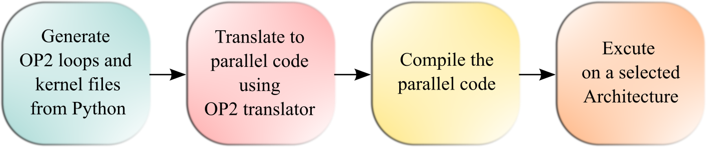

Introduction
===============

Overview
--------

The main objective of project `Unstructured FVM <https://github.com/UnstructuredFVM>`_ is to develop a Finite Volume Method (FVM) based CFD solver capable of simulating hypersonic flows in 2-D unstructured mesh configuration by solving compressible Navier-Stokes equations coupled with species continuty equations.

Based on the properties of the surrounding flow two versions of the solver are developed *PerfectGas* Solver which is equivalent to the Earth's atmosphere and *CO*:sub:`2` Solver is similar to the Martian atmosphere. In PerfectGas solver universal gas constant is considered while solving the equations where as in *CO*:sub:`2` solver there are eight different species of gases containing *N*:sub:`2`, *O*:sub:`2`, *NO*, *O*, *N*, *CO*:sub:`2`, *CO* and *C*. The chemical kinetics for these eight species is incorporated in the *CO*:sub:`2` solver.

The principal application of this solver is to simulate the re-entry vehicles travelling at hypersonic speed and reaching high surface temperatures where the surrounding gaseous molecules start reacting with each other. The solver uses AUSM :math:`\delta` schemes for evaluating convective flux terms and node gradients for calculating viscous flux terms. For first order accuracy explicit Euler scheme is utilized for temporal discretization and for higher order of accuracy vklimiters are used.

Implementation
--------------

In order to achive parallel computing capabilities the solver is integrated with `OP2 <https://op-dsl.github.io/index.html>`_ Framework. OP2 (Oxford Parallel library for Unstructured mesh solvers) is an Application Programming Interface (API) which generates parallel code for various computational architectures like ``OpenMP``, ``OpenCL``, ``CUDA``, etc., using a single source code. The generated code can be executed on single/multi core CPU's and GPU's.

The solver is developed using automatic code generation techniques similar to `OpenSBLI <https://opensbli.github.io/>`_. The code is initially written in Python programming language using Symbolic python (SymPy) library to process Einstein formulation of the equations. This python code generates OP2 compliant ``#C`` code which is then translated using OP2 code translator and compiled to generate executable code for different computational architectures.

   Fig.1: Automatic Code Generation Schematic

